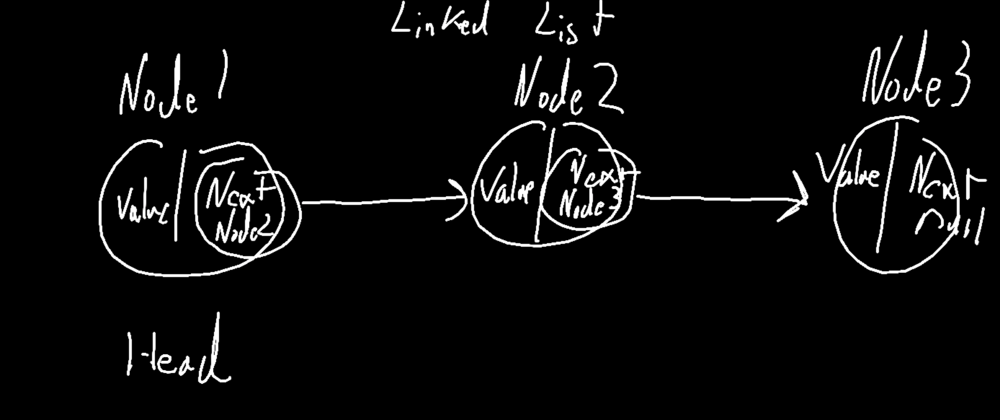

# Class 05 Resumes and Linked Lists

## Resume Prep

### 7 Steps to landing a job

1. Job search
1. resume
1. Initial phone screen
1. Technical phone screen
1. In person Interview
1. Job Offer
1. Accepting an Offer

### Resume Contents

1. Contact Information

- Name: avoid middle names, nicknames, initials
- Location: city and state
- Phone nunmber / email address
- LinkedIn URL: make sure it's customized (easy to read)
- Github URL / Personal website.
- Don't include protocols or www ( these just add visual clutter )

1. Profile Statement

- A summary of what you have to offer and what you really care about.
- Highlight areas of expertise.
- Any experience / education / job-specific skills.
- Keep soft skills / personality traits to a minimum.
- Only a few lines.

1. Technical Skills

- Prioritize skills you would like to use in your next role.
- Languages, tools, frameworks.
- Designing vs developing.
- Should not include sosft skills or personality traits.

1. Projects

- When the project was completes
- Make sure to include a hyperlink toas a github repo ( deployment as well if possisble)
- Brief mention of technologies used.

1. Experience

- Emploment History / Job Title / Organization Name
- Make sure to include relavent dates
- Discusss responsiblitiess and accomplishments.
- Qualify relevent experiences and any.

1. Education

- School or Institution Name.
- Graduation or Completion date ( not all that important if not withing the last 5 years)
- Type of degree / focus of the program.

## Linked Lists

- Concepts of What makes up a linked List
  - New Vocabularily which will be a litle abstract.
  - Main focus will be implementation.

- What is a linked list
  - a rudimetary system for grouping things together.

```js

// using a the data structure "Array" literal
let numbers = [1,2,3];

// same things, but with simpler pointers:
let one =1;
let two =2;
let three =3;

// how do we group things together without any "complex" data structure?
```

- a sequence of Nodes that are connected/linked to each other. The most defining characteristic is that each node points to another Node. ( Recursive ).
- Two type of Linked list: singly linked list (goes one way), doubly linked list(goes both ways).

## Linked List Terminlogy Terms

- Linked List: A data structure, that contains nodes that link/point to another Node in the list.
- Singly: refers to the number of references that a node has, singly linked lists have just one reference called Next.
- Doubly: refer to twice the number of references: their node has two references: next and previous.
- Head: Represents the first Node of the linked List.
- Current: refererences the current value being expamined in a linked list, typiacalyy used in traversal.
- Traversal: maneuvering through all oof a linked lists Nodes.

- Visualizing the Data Structure
- 

## Traversal

- We don't have methods like forEach or for loop. We have to rely on Next to get other values in our linked list. This property is very important to our definition.
- The most straightforward approach is a while loop, we can continuaously check if something is true or not.
- We can think of our current and a reference to hopefully another node which we gain from Next.
  - As long as we can keep setting current to a nother Node we have more Nodes to look at.

```java

// We have to assume that the Node is part of a liked list.
ALGORITHM traverse(Linkedlist)

    VARIABLE current = LinkedList.Head

    WHILE current NOT EQUAL TO null

      check(current.Value)
      current = current.Next
    <!-- here we can possibly add -->
      IF current.next EQUALs null


    RETURN true;

```

## Big O Notation

- How Complex is this Algorithm?
  - In order to talk about complexity in a consistent albeit very high level way: Big o notation.
  - Regarding the input that my algoroithm deals with.

- O(scale of complexity)
  - Used to measure both complexity of time(does it take longer) and resources( am I creating a bunch of variables );
- O(1): contanst state of complexity no matter what things my algorithm has to deal.

```js
function constantTime(message) {
  for (let i = 0; i < 10; i ++) {
    console.log(message);
  }
}
```

- 0(n): complexity scales directly with inputs

```js

function oneToOnetime(message) {
  for (let i = 0; i < message.length; i++) {
    console.log(message);
  }
}

```

- O(1 - nth n) We fall back to O(n)
- O(n^2): exponentially more complex given the input

```js

function exponential(message) {
  for (let i = 0; i < message.length; i++) {
    for (let i = 0; i < message.length; i++) {
      console.log(message);
    }
  }
}

```

- If we use our Algorithm frmo above, what do time complexity:
  - O(n)time? Yes it is 0n
- What about the space complexity, ( How many resources is my algorithm using? ).
  - O(1)space?
- This should be something your aware, this should far from your main concern.  You want something too work first -> analze -> refactoring.

## Add a Value to the end a Linked List

- Copy Linked
- Insert into that linked list?
- Same process ( for the most part ) but when we run innto our null Next value:
- set that Next to a new Node containing the Value.

```java
ALGORITHM add(LinkedList, value)

    VARIABLE current = LinkedList.Head

    WHILE current NOT EQUAL TO null

      // Before we move current to the Next property, check if it's there
      IF current.next EQUALs null
        // If not add our Node
        current.Next = new Node(value)
        RETURN LinkedList

      current = current.Next
```

### JS Implementation

- see linked-list folder
