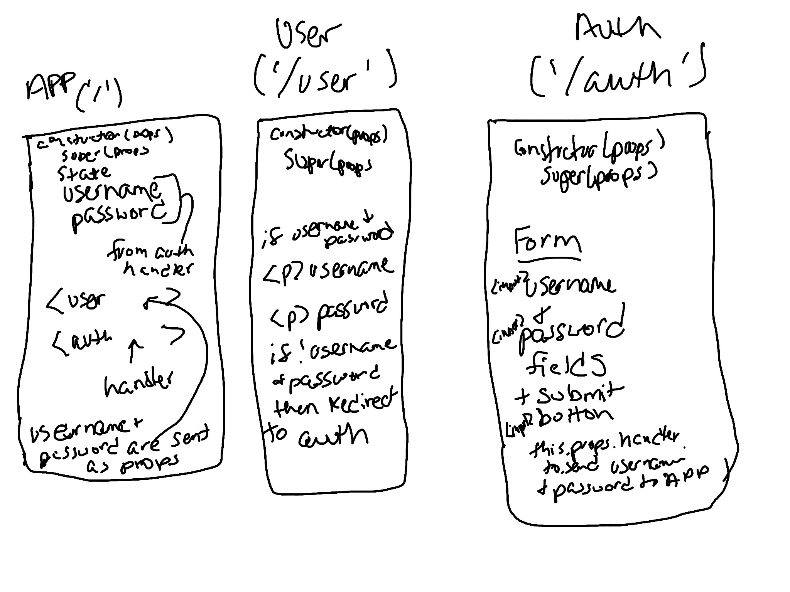
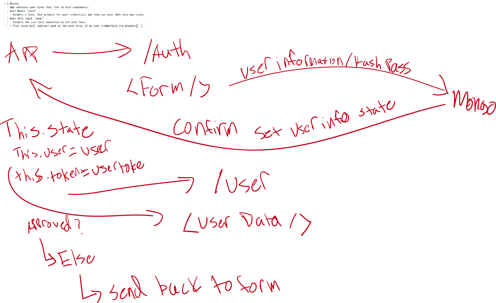

# Class 31

## Warm Up / Review

- Ashley: Getting an individual item in a list to update.
  - Should one list item be its own component?
  - Jacob: yes and no :P, It depends

- Paul: Why React?
  - What problems does React solve that things like EJS, Handlebars.
  - Developing at scale, is probably oging to be smoother with API similar to Reacts.
    - Component Architecure combing busniess and view logic in a module.
    - This is really nice, because we can add funcitonality really easily with a consistent syntax.
    - Embedded server side, so you need a server side framework, like Express.
    - Better Application Architecture.
  - One of the biggest mistakes that startups is jumping straight to React. A smaller templating libary would work just fine.

 

### React / Hashmap Review

- What is React?
  - Paul: JS Framework, for standardizing web components for state driven web applications.
- What is a React Component?
  - Ashley: a template that can be reused for using the same UI structure but with different data.
    - class of thing, that encapsulates methods, and state.
  - Something that returns / renders JSX ( React specific ).
- What is state and props?
  - Marlene: state is what the component cares about, props are info passed from the parent to the child.
    - Paul: component sets its own state.
    - Jacob: props are not directly controlled by the component in which they are used.
- What is 1 way data binding?
  - Dave: React uses one way communication, everything trickles down.  This refers to the way, 'this' binds data and the flow of data from the parent into the child.
- What is component Routing?
  - Garhett: Uses a "router" to set paths, different paths render you differnet components / views.
    - Jacob: Single page apps load faster than requesting a whole new HTML. Big performance boost for "load times".

### Build a small authentication App

- 2 Routes
  - App contains some links that link to both components.
  - Auth Route '/auth'
    - Renders a form, that prompts for auth credentials and then can save them into App state.
  - User Info route '/user'
    - Renders the user data submitted in the auth form.
    - This route will redirect back to the auth form, if no user credentials are present.

- Check out `warm-up` directory!

## React Component Syntax

- React prefers functional components over class components for 2 reasons
  - They offer a small performance boost ( because we don' have to track components in the virtual DOM )
    - Intantiate something, that hold specific values ( state ) and incapsulates any number of properties.
  - They are much easier for the average js developer to comprehend
    - Less React jargon, and more native javascript operations.
    - You can see props come in as a arguement.
    - Managing two many magic property values ( this.props, this.state ).
  - Really anything that has state ( up until today ) there is only the class component. Any dumb component ( things that don't have a lot of business logic, things that don't need to persist data trough is render) could be a functional.

## Hooks API

- Much of our syntax, ( from the functional componen side )
- In React version 16.x React says you can "hook" into the same API that state components, but now within a functional component
  - useState: a hook that lets us "set" and "get" a value that React manages with an internal API ( similar to this.state / this.setState );
  - The API does not work exactly the same
    - Each property should be set independently

```js
import React, { useState } from 'react';

const Counter = (props) => {

  // const number = 25;
  // const changeNumber = () => {
  //   number += 1;
  // }

  // useState returns a "getter" and a "setter", without any encapsulation regarding "this"
  const [ number, changeNumber ] = useState(props.number);
    // this will only exist within this function, duplicate code will referenece different state's
    // can't be used in a class component

  return (
    <div>
      <p onClick={() => changeNumber(number + 1)}>{number}</p>
    </div>
  )
}

export default Counter;

```

- useEffect: replacement for lifecycle methods
  - Life Cycle methods: Error always pops up
    - The events that occur when a component is intiialized.
      - `import Component from 'component'`
        - `<Component />` - this is intilization, every time this happend in our app we experience the following
          - Interpret props => componentDidReceiveProps
          - create our contructor variables => componentWillMount
            - maybe we need to make API call before we render?
          - Mount the DOM => componentDidMount
          - Render the components => render()
          - Check for updates => componentWillUpdate
            - every time a state property changes / props property changes
          - Unmount when the window closes.
  - React has simplified these down to one hook: useEffect();
    - Meant to manage sideEffects, DOM has changes in some way ( which should reflect an applicaction update ).
    - When this happend the component should update itself in some way.
