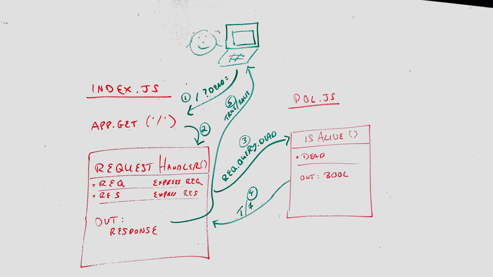

# LAB - 00

## Deployment Tutorial

### Author: John Cokos

- [submission PR](https://github.com/tutuorial-401js/class-00)
- [tests report](https://github.com/tutuorial-401js/class-00/actions)
- [front-end](https://tutorial-401js.herokuapp.com/)

### Setup

#### `.env` requirements

- `PORT` - Port Number

#### Running the app

- `npm start`
- Endpoint: `/`
  - Returns true or false

#### Tests

- Unit Tests: `npm run test`
- Lint Tests: `npm run lint`
- Assertions Made
  - Assert that isAlive() properly returns a boolean
- Assertions Remaining
  - ... Things I want to tests, but didn't yet.

#### UML

